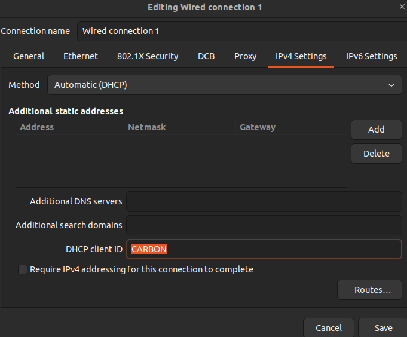

# Install updates/upgrades
```
sudo apt update
sudo apt upgrade
sudo apt autoremove
```
# Upgrade release
```
sudo do-release-upgrade
```

# Wireless network (Eduroam)
* Setup eduroam using these instructions: https://www.universityofgalway.ie/information-solutions-services/servicesforstaff/wifi/eduroam/ 
* Down the "certificate", likely called something like: `nuigalway_Managed_Radius_CA_Root.crt`
* Download and run the python script `eduroam-linux-UoG.py`: 
```
./eduroam-linux-UoG.py 
```
* Now edit the wife connection settings, e.g. by running the following and selecting the wireless connection:
```
nm-connection-editor
```
The below shows the correct settings: 


Note how the `username` is set and how the certificate is selected. 

# Wired internet connection
## Install "Carbon Black"
* Extract the archive e.g. the tar file `cb-psc-sensor-ubuntu-2.14.0.1321525` or an equivalent provided by ISS. 
* Right click the `install.sh` file, Properties, Permissions, tick Allow Execution as Program 
* Run the installation using
```
sudo ./install.sh
```
## Edit wired connection settings
* Now edit the wired connection settings, e.g. by running the following and selecting the wired connection:
```
nm-connection-editor
```
* Go to the `IPv4 Settings`, and set the `DHCP Client id` to `CARBON`. 

The below shows the correct settings: 



# Check of "Additional drivers" e.g. for NVIDIA
Some devices, e.g. the NVIDIA graphics card, might require a proprietary driver, or an alternative driver. The below images shows how one can pick one.


Note some graphics drivers may not be compatible with all software (e.g. MATLAB).

# Install usefull packages
* GIMP
* Inkscape
* Ghostwriter
* Xournal++
* Meld
* Telegram
* Slack
* MS Teams
* Meshlab

# Download + install packages
## VS code
* Download .deb file: https://code.visualstudio.com/Download
* Right click, Properties, Permissions, tick Allow Execution as Program 

## Add Julia
* Download: https://julialang.org/downloads/, e.g. the latest 64-bit glibc version
* Extract. 
* Then browse into the extracted folder to find the folder containing the content like the bin folder etc. Copy/cut all content and move to a local folder where you want Julia to exist e.g. `/home/kevin/julia/`. Not have the version tag in this folder name, so plain `julia` rather than `julia-1.8.5` means the symbolic links can stay constant when you upgrade julia in the future. 

* Setup julia

```
sudo ln -s /home/kevin/julia/bin/julia /usr/bin/julia
```
Export path
```
export PATH="$PATH:/home/kevin/julia/bin"
```

Julia packages to add: 
* IJulia
```
]add IJulia
```
* Gridap
```
]add Gridap
```
* Makie: https://docs.makie.org/stable/
```
]add GLMakie
```

## Git
* Install
```
sudo apt install git
```
* Configure git with the correct user name and user email, see also: https://git-scm.com/book/en/v2/Getting-Started-First-Time-Git-Setup
* Set user name: 
```
git config --global user.name "Kevin-Mattheus-Moerman"
```
* Set user email: 
```
git config --global user.email kevin.moerman@gmail.com
```

## GNU Octave
```
sudo apt install octave
```
 
## Install Conda
* Download the installation `.sh` file: https://www.anaconda.com/download/
* Right click, Properties, Permissions, tick Allow Execution as Program 
* Open a terminal in that folder run equivalent of:
```
./Anaconda3-2023.03-Linux-x86_64.sh
```
Conda packages to add: 
* Jupyter notebooks support
```
conda install jupyter
```
* RISE https://rise.readthedocs.io/en/stable/installation.html
```
conda install -c conda-forge rise
```
* Octave kernel https://pypi.org/project/octave-kernel/
```
conda config --add channels conda-forge
conda install octave_kernel
conda install texinfo # For the inline documentation (shift-tab) to appear
```

## Tex / LATeX (SLOW/LONG!)
```
sudo apt install texlive-full
```

# Configure Git + GitHub SSH

* Follow these instructions to help set-up an SSH key: 
https://docs.github.com/en/authentication/connecting-to-github-with-ssh
E.g.
```
ssh-keygen -t ed25519 -C "your_email@example.com"
```
and press Enter to accept the default file location (or alter the file location if desired). Next type a secure passphrase. 
* To adding your SSH key to the ssh-agent, first start the ssh-agent in the background using
```
eval "$(ssh-agent -s)"
```
Next add the ssh key using: 
```
ssh-add ~/.ssh/id_ed25519
```

* Follow these instructions to add an SSH key to your GitHub account: 
https://docs.github.com/en/authentication/connecting-to-github-with-ssh/adding-a-new-ssh-key-to-your-github-account
* https://docs.github.com/en/authentication/connecting-to-github-with-ssh
* You may need to use the following to avoid what might be firewall issues, e.g.  
https://stackoverflow.com/questions/15589682/ssh-connect-to-host-github-com-port-22-connection-timed-out, i.e. open a terminal and make the following ssh condiguration steps: 
```
sudo nano ~/.ssh/config
```
Next add the following lines: 
```
Host github.com
 Hostname ssh.github.com
 Port 443
```


# Get LibreOffice plugins
* TexMaths https://extensions.libreoffice.org/en/extensions/show/texmaths-1, download the OXT file, go to LibreOffice Writer, Tools, Extension Manager, Add, then browse to the OXT file. 

# MATLAB
* Download installer
* Right click, Properties, Permissions, tick Allow Execution as Program 
* Extract
* Browse to folder containing `install`, open a terminal and run: 
```
./install
```
Do not run the install as administrator. You can create symbolic links later
* 
* Follow these instructions: 
https://uk.mathworks.com/matlabcentral/answers/1468426-cannot-enable-hardware-opengl-r2021b-ubuntu-20-04, which state that in your `home` folder (or where ever you run a terminal to execute `matlab`) you should add a file called `jave.opts` and add the following line: 
```
-Djogl.disable.openglarbcontext=1
```
* Create the symbolic links
```
sudo ln -s /home/kevin/matlab/bin/matlab /usr/bin/matlab
```
Export path
```
export PATH="$PATH:/home/kevin/matlab/bin"
```
* Install the MATLAB support package
```
sudo apt install matlab-support
```
* Rename https://uk.mathworks.com/matlabcentral/answers/241850-matlab-failing-to-find-hardware-opengl
* Similar to: 
```
cd /home/kevin/matlab/sys/os/glnxa64/
$ sudo mv libstdc++.so.6 libstdc++.so.6.bak
```

# Ubuntu things
* Enable add new empty file on right click e.g. 
```
touch ~/Templates/newTextFile.txt
```


